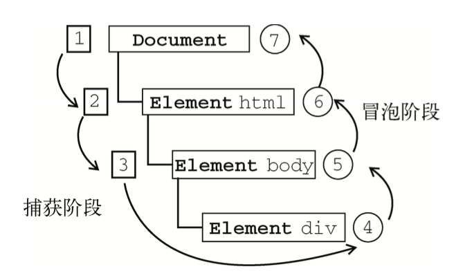

# 冒泡和捕获

好像阿里有这么一道面试题：

> 一个dom同时绑定两个点击事件，一个用捕获，一个用冒泡。会执行几次事件，会先执行冒泡还是捕获？

这个问题其实问的是DOM事件流的相关知识。

## 事件绑定
我们知道，DOM2级事件处理通过addEventListener()和removeEventListener()处理指定和删除事件处理程序的操作，这两个方法接收三个参数：要处理的事件名、作为事件处理的一个函数和一个布尔值（true表示在捕获阶段调用事件处理程序，false表示在冒泡阶段调用事件处理程序）。

IE事件处理通过attachEvent()和deleteEvent()绑定和删除事件。这两个方法有两个参数，第一个参数是on+事件名（程序中的this等于window），第二个参数是事件处理程序。

## 事件处理程序

当为同一个元素添加多个事件时，DOM2级方法是按**添加顺序**执行的。IE级事件绑定的方法是以**相反的顺序**执行的。 

DOM2级事件规定的事件流包括三个阶段：事件捕获阶段、处于目标阶段和事件冒泡阶段。首先先发生的是事件捕获，为截取事件提供了机会。然后是事件目标接收到事件。最后一个阶段是冒泡阶段，可以在这个阶段对事件作出响应。IE8之前的浏览器只支持事件冒泡流 ，不支持事件捕获流。

结合上面两段内容：添加多个事件时按添加顺序执行 + 事件流3阶段，可以得出该面试题的回答如下：

> 不管怎么绑定的，事件会按照这样的顺序执行：

> 1. 父元素的捕获事件。如果有，按添加顺序依次执行；

> 2. 触发元素的事件。如果有，无论冒泡还是捕获，按添加顺序依次执行；

> 3. 父元素的冒泡事件。如果有，按添加顺序依次执行。

以上。