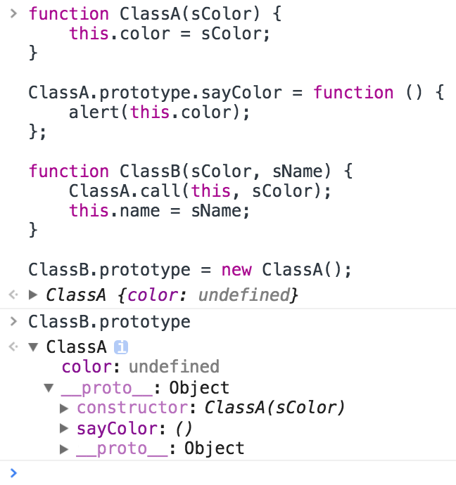

# 面向对象与原型

[参考 - JS高级程序设计]()

## 创建对象：

1. 工厂模式（可以创建多个相似对象，但不能识别对象的类型）
2. 构造函数模式（可以识别对象的类型，但是会重复实例化其中的方法）
3. 原型模式（共享属性和实例）
4. 组合使用构造函数模式和原型模式
5. 动态原型模式
6. 寄生构造函数模式
7. 稳妥构造函数模式

* 原型对象挂了个isPrototype方法；Object.getPrototype(obj)则会返回\_\_proto\_\_

## 继承

继承最初有对象冒充的思想，也即：
```javascript
function ClassA(sColor) {
    this.color = sColor;
    this.sayColor = function () {
        alert(this.color);
    };
}

function ClassB(sColor, sName) {
    this.newMethod = ClassA;
    this.newMethod(sColor);
    delete this.newMethod;

    this.name = sName;
    this.sayName = function () {
        alert(this.name);
    };
}
```
这里其实就是借助一个辅助函数来使得ClassA里的this指向ClassB实例化的对象。

既然如此不如用call或apply，第一个参数就是指定this所指：
```javascript
function ClassB(sColor, sName) {
    //this.newMethod = ClassA;
    //this.newMethod(color);
    //delete this.newMethod;
    ClassA.call(this, sColor);

    this.name = sName;
    this.sayName = function () {
        alert(this.name);
    };
}
```
```javascript
function ClassB(sColor, sName) {
    //this.newMethod = ClassA;
    //this.newMethod(color);
    //delete this.newMethod;
    ClassA.apply(this, arguments);

    this.name = sName;
    this.sayName = function () {
        alert(this.name);
    };
}
```
当然，apply需要保证参数列表顺序相同，如果不同，还是用call吧。

除了上述三种，还有原型链的继承方式：
```javascript
function ClassA() {
}

ClassA.prototype.color = "blue";
ClassA.prototype.sayColor = function () {
    alert(this.color);
};

function ClassB() {
}

ClassB.prototype = new ClassA();

ClassB.prototype.name = "";
ClassB.prototype.sayName = function () {
    alert(this.name);
};
```

还有第四种实现继承的方法,就是混合方式.对象冒充存在必须使用构造函数的问题,
单纯使用原型链则**无法使用带参数的构造函数**.
这还不是最严重的问题,之所以单独使用原型模式不可行,是因为当原型包含
引用类型值的属性时会导致**共享问题**。
两种都用挺不错的.

```javascript
function ClassA(sColor) {
    this.color = sColor;
}

ClassA.prototype.sayColor = function () {
    alert(this.color);
};

function ClassB(sColor, sName) {
    ClassA.call(this, sColor);
    this.name = sName;
}

ClassB.prototype = new ClassA();

ClassB.prototype.sayName = function () {
    alert(this.name);
};
```

属性就定义在构造函数内部,这样只允许公有方法修改属性而不能直接引用修改;
继承的时候,也可ClassA.call(this,sColor)这样设置继承来的属性;
而方法则挂在原型下,而方法的继承则通过new ClassA()来挂在原型下实现.
这样,在使用的时候,就可以使用带参数的构造函数很方便的构造了.

```javascript
var objA = new ClassA("blue");
var objB = new ClassB("red", "John");
objA.sayColor();	//输出 "blue"
objB.sayColor();	//输出 "red"
objB.sayName();	//输出 "John"
```

如下代码段可以加深理解(后来发现红皮书p168的例子也是可以的)
```javascript
function ClassA(sColor) {
    console.log('In ClassA')
    console.log(this instanceof ClassA)
    console.log(this instanceof ClassB)
    this.color = sColor;   
}

ClassA.prototype.sayColor = function () {
    console.log('In ClassA sayColor');
};

function ClassB(sColor, sName) {
    console.log('In ClassB')
    ClassA.call(this, sColor);
    this.name = sName;
}
// 红皮书：每个构造函数都有一个原型对象，原型对象都包含一个指向构造函数的指针，而实例都包含一个指向原型对象的内部指针。
// 如果让原型对象等于另一个类型的实例，此时原型对象将包含一个指向另一个原型的指针，另一个原型中也包含着一个指向另一个构造函数的指针。
// 下面这样写会覆盖ClassB原来的原型对象，所以constructor会变成ClassA，因此最后还需要给它改回来
ClassB.prototype = new ClassA();//根据我目前的理解，这句的作用就是为了把原型链串起来！注意ClassA的参数为空！

ClassB.prototype.sayName = function () {
    console.log('In ClassB sayName');
};

var objA = new ClassA("blue");
var objB = new ClassB("red", "John");
objA.sayColor();
objB.sayColor();
objB.sayName();
```

另外,此时的objB.constructor.name仍然是"ClassA",此时需要
```javascript
ClassB.prototype.constructor = ClassB;
```
这样才能比较好的实现.

---
**补充** 为什么name仍为"ClassA"呢？

因为现在ClassB.prototype上压根没有constructor啊！引用它的话只会沿着\_\_proto\_\_去找
然后找到ClassA.prototype.constructor啊！那么就是ClassA呀！

所以我们手动赋值。但是ClassB.prototype.constructor和ClassA.prototype.constructor
不一样，在chrome里，ClassA.prototype.constructor是浅色，表面其内部变量的身份。

---

**补充** 知道ClassB.prototype = new ClassA();这句话到底发生了神马么？

new ClassA()生成一个对象，这个对象有一个undefined的变量color(毕竟压根没传值嘛)，然后就没了！是的，有个内部指针\_\_proto\_\_，它指向了ClassA.prototype，所以才有了ClassA这个constructor和sayColor这个方法！再proto下去就是Object.prototype了...这就是原型链啊吼不吼啊！Exciting啊！！

话不多说，看图吧。


---
我印象中有更简单且好的方法(除了ES6),但是想不起来了……

最后介绍下Object.create(obj, discriptor)，可以靠一个现有对象进行简单继承。

最后的最后加一个图，太牛逼了：


图中可以补充：

1. foo.constructor === Foo

2. obj.constructor === Object

3. Foo.constructor === Function
 
另外，关于__proto__，是一个非标属性，虽然目前得到了大部分浏览器的支持，但是不建议直接操作，可以使用**Object.getPrototypeOf**方法获取构造函数的原型对象。ES6以前只是浏览器放出的私有属性，ES6已经支持。

**注意** __proto__是实例指向原型对象;prototype是构造函数指向原型对象。

[参考](http://www.cnblogs.com/snandy/archive/2012/09/01/2664134.html)

